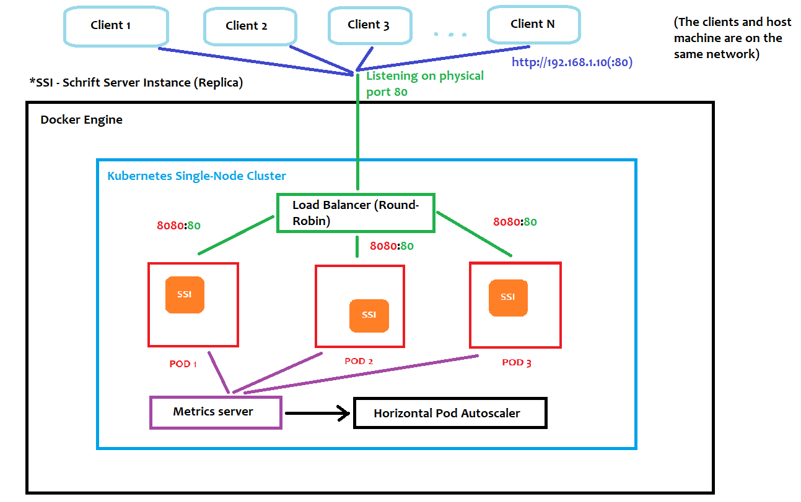

# schrift-vot-project
Втори проект по ВОТ за II-ри срок, на Мартин Наков.
Колаборативен текстов редактор с еластичност, скалируемост и висока отказоустойчивост.

## Инсталация
``console
cd ./scripts
./setup.sh
``

След като инициализацията на Kubernetes клъстера се изпълни, можете да видите приложението на `http://localhost`.

## Инфраструктура

## Използвана технология
- Node.js
- Express
- Docker
- Kubernetes
- Quill.js
- Socket.io